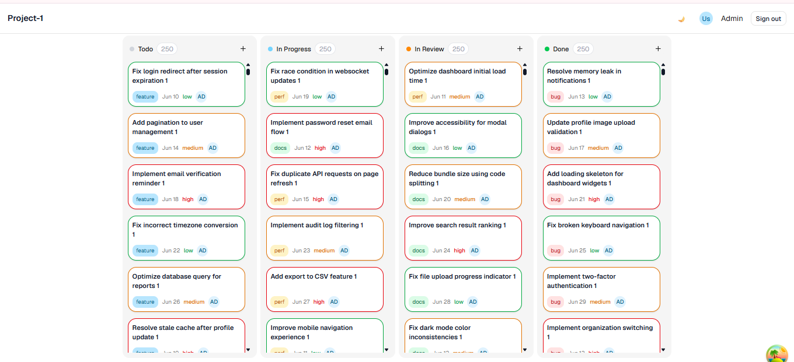
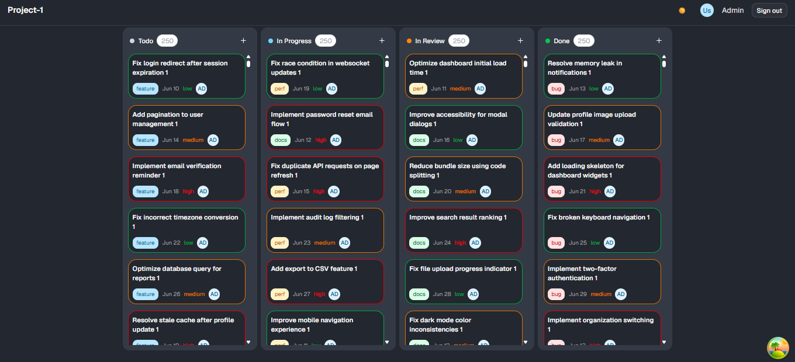

# NarBoard

A task management app built with React to track and manage project progress across different stages.

## Overview

NarBoard is a Kanban-style task manager where you can create, edit, delete, and drag tasks between columns to track their progress. Built as a real-world architecture practice project.

## Live Demo

_Coming soon_

## Screenshots

## Tech Stack

| Tool                  | Why                                                 |
| --------------------- | --------------------------------------------------- |
| React 19 + TypeScript | Industry standard, strict type safety               |
| Vite                  | Fast development server                             |
| TanStack Query        | Server state management, caching, and data fetching |
| Zustand               | Lightweight client state management                 |
| React Hook Form + Zod | Form handling with runtime schema validation        |
| dnd-kit               | Accessible drag and drop                            |
| Tailwind CSS v4       | Utility-first styling                               |
| shadcn/ui             | Accessible, unstyled component primitives           |
| Axios                 | HTTP client with interceptor support                |

## Features

- Authentication with login/logout and persistent sessions
- Protected and public route guards
- Kanban board with 4 columns — Todo, In Progress, In Review, Done
- Create, edit, and delete tasks
- Drag and drop tasks between columns
- Role-based users (admin / member)

## Architecture Decisions

### Feature-based folder structure

Code is organized by feature (`features/auth/`, `features/board/`) rather than by type (`components/`, `hooks/`). Everything related to a feature lives together — easier to navigate, easier to scale.

### Repository pattern

All data access goes through a repository interface (`IAuthRepository`, `IBoardRepository`). Currently backed by mock implementations (`MockAuthRepository`, `MockBoardRepository`) that simulate real network calls with delays. Swapping to a real backend only requires changing one line in `src/services/index.ts` — no component or hook changes needed.

### TanStack Query vs Zustand

- **TanStack Query** owns all server state — tasks, board data. Handles caching, refetching, and invalidation automatically.
- **Zustand** owns client state only — auth session, UI state. Persisted to localStorage so sessions survive page refresh.

### Centralized route constants

All routes are defined as typed constants in `src/router/routes.ts` split into `PUBLIC_ROUTES` and `PROTECTED_ROUTES`. No hardcoded strings anywhere in the app.

### Axios interceptors

Silent token refresh is handled automatically via response interceptors. When a request returns 401, the app refreshes the access token and retries the original request — the user never gets logged out unexpectedly.
